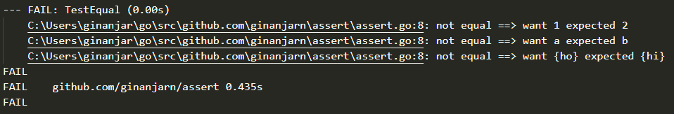

# Assert
## Description
This golang library used to simplify assert testing
## Function
* Equal(equal compare)
```c
// t as testing pointer
// x as param x
// y as param y compared

assert.Equal(t, x, y)
// if error will be printed in testing output
```
